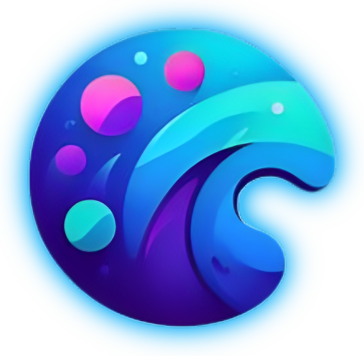

  

Welcome to Canvas
=================

_A Minecraft ServerType aimed for creativity and performance._

Introduction
------------

Canvas is a ServerType for Minecraft based on Purpur that tries to give plugin developers unlimted freedom when making
plugins, while keeping the server quick and performant.

Why use Canvas?
---------------

Canvas has an active development team constantly working on fixes and improvements, making new apis, features, and more.
Canvas has been put to the test vs Paper and Purpur and definetly beats them in both performance, and api features. Its
built to handle whatever you throw at it, so the only limit, is your imagination.

Features
--------

* \- Multithreaded world ticking
* \- Builtin Mixin
* \- Enhanced APIs
* \- New insane APIs
* Optimization descriptions can be found in the OPTIMIZATIONS.md file for more info

Resources
---------

* GitHub Repository: [https://github.com/CraftCanvasMC/Canvas](https://github.com/CraftCanvasMC/Canvas)
* Donation: [https://ko-fi.com/dueris](https://ko-fi.com/dueris)

Join Our Community
------------------

Join our Discord server to stay updated and connect with the Canvas community:

Contributing
------------

We welcome contributions from the community. If you'd like to contribute to Canvas, please read
our [contributing guidelines](CONTRIBUTING.md) for more information.

License
-------

Canvas is open-source software licensed under the GNU General Public License version 3 License.

**Sponsored by BisectHosting!**
-------------------------------

* * *

_Canvas - Empowering the Impossibe_  

