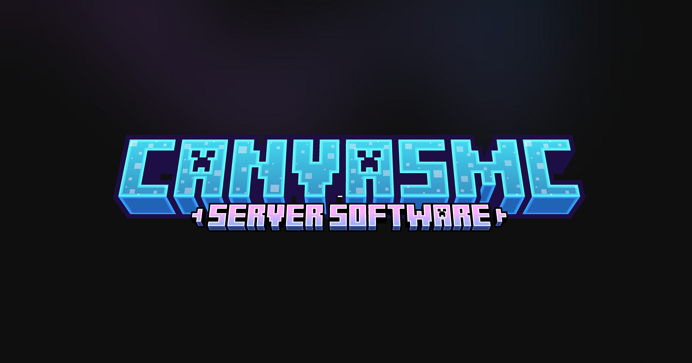

[](LICENSE)  
[](https://github.com/CraftCanvasMC/Canvas)  
[](https://github.com/CraftCanvasMC/Canvas)  

CanvasMC is a high performance fork of Folia aiming to provide a stable and consistent region threading environment, alongside tons of optimizations and performance features for large scale servers.

---
[](https://bstats.org/plugin/server-implementation/Canvas)
---

## Features & Highlights

### Alternative Scheduler
- Canvas provides a scheduler written by the team called the `AFFINITY` scheduler, which contains configurable features that increase performance immensely.

### Optimized Chunk Generation
- Canvas replaces a rewritten chunk system pool, providing further optimizations that help with scaling and single-threaded throughput

### Extensive Configuration
- Fine-tune aspects of your server with fully documented configuration options and performance settings.

### Proper Region Profiling
- Canvas introduces a full Spark profiler that is fully compatible with region threading, replacing the limited Folia profiling engine.

### Powerful and Optimized
- By fixing **numerous** Folia bugs and crashes, Canvas delivers a high-performance, stable, and reliable experience.

---

## Getting Started

### Downloading & Running

1. Download the latest server JAR from the **Downloads** page on [canvasmc.io](https://canvasmc.io/downloads/canvas).  
2. Launch using Java (Java 25+ required) with your preferred arguments and configuration.

### Building from Source

**Requirements:**

- Java 25
- Git (configured with name/email)

**Common build commands:**

```bash
./gradlew applyAllPatches # Applies all patches to construct the Canvas source
./gradlew createPaperclipJar # Creates the paperclip jar
./gradlew runDev # Starts a development server locally
```

## Documentation & Resources

* **Official Documentation**: [https://docs.canvasmc.io](https://docs.canvasmc.io)
* **Community & Support**: Join the Canvas [Discord](https://canvasmc.io/discord)
* **Issue Tracker / Contributing**: Use this GitHub repo for reporting bugs, proposing features, and submitting pull requests
* **Donations / Sponsorship**: Support development on [Ko-fi](https://ko-fi.com/dueris)

---

## Contributing

We welcome many forms of contributions:

* Code (bug fixes, features)
* Documentation improvements
* Testing & bug reporting
* Community help & support
* Donations to help support the developers

See the [Canvas Contributing Guide](https://docs.canvasmc.io/guides/developers/contributing/canvas/) for more detail.

---

## Compatibility & Notes

* Canvas is a fork of **Folia** and is *not* a drop-in replacement for Purpur, Paper, or other non-Folia forks. It is intended primarily for environments already using Folia or Folia-based forks.
* The project adheres strictly to Folia’s threading and safety rules and does *not* permit bypassing them.

---

## License

This project is licensed under the **GNU General Public License v3.0 (GPL-3.0)**.

---

## Acknowledgments & Inspiration

Canvas incorporates patches inspired by or derived from other high-performance projects (e.g. **Lithium**, **Leaf**, **Luminol**), along with its own custom optimizations.
